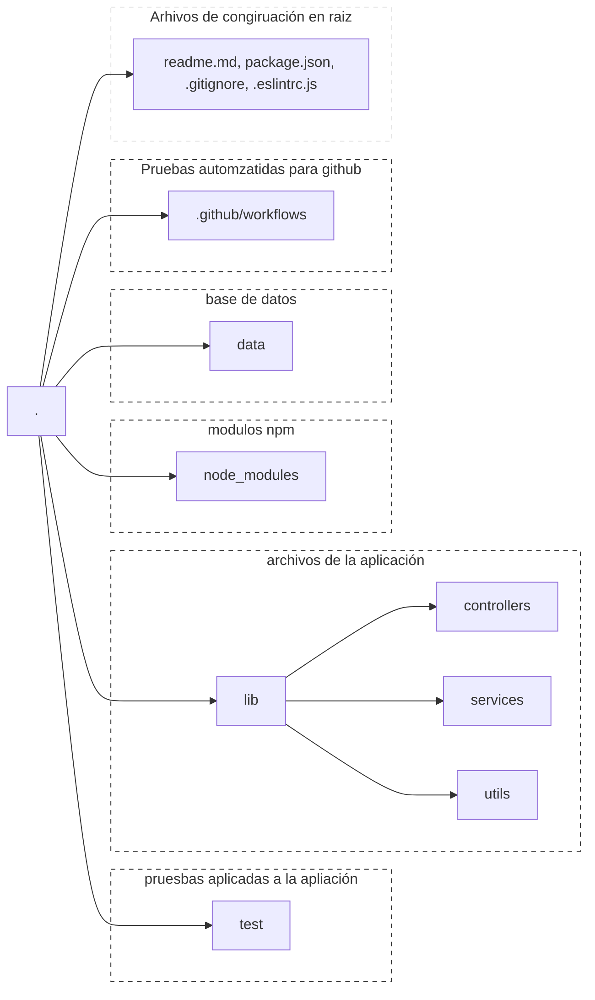
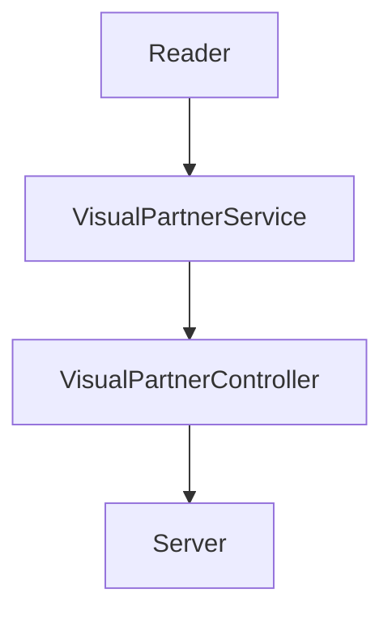

# :rocket: Code Challenge - Visual Thinking API


Proyecto desarrollado para el programa de formación [©Launch X 2022](https://launchx.rocks/) de [Innovaccionvirtual](https://www.instagram.com/innovaccionvirtual/) impulsado por [Microsoft](https://www.microsoft.com/es-mx/)


## :grey_question: Descripción

Desarrollando una API para exponer una base de datos basada en un archivo json, ello a través de 3 los siguientes end point's

| endpoint | url | descripción |
| --- | --- | --- |
| /api/students/ | http:3000//localhost/api/students/ | Obtiene todos los estudiantes de la base de datos |
| /api/students/certified | http:3000//localhost/api/students/certifiedStudents/ | Obtiene los estudiantes que tengan certificación |
| /api/students/credits/top500 | http:3000//api/students/credits/top500 | Obtienes los estudiantes con credits mayor a 500 |


> :art: Arte realizado por @carlogilmar para @LaunchX-InnovaccionVirtual


## :ticket: Estructura del proyecto




## :construction: Diseño de componentes



Estos componentes se ubican dentro de la carpteta **lib**

### Reader

El componente **Reader** se encarga de la lectura de la base de datos, en nuestro caso se maneja en un archivo de .json

### VisualPartnerService

Este componente se encarga de procesar los datos aplicando las reglas de negocio

### VisualPartnerController

Este componente se ecarga de cargar los datos del origine y aplicar las reglas de negocio con el componente **VisualPartnerService**

### Server

Este compenente se encarga de exponer la **API** mendiante un servidor de express


## Como utilizar el proyecto

### Correr la aplicación

```bash
npm run server
```


### ejecutar las pruebas unitarias


### Comprobación de syntaxis con **Linnter**


### Corrección de systenxis con **Linter**


## :checkered_flag: Dependencias

El proyecto usa la siguiente dependencias para su ejecución

- eslint ^8.14.0,
- express ^4.18.1
- jest ^26.0.0