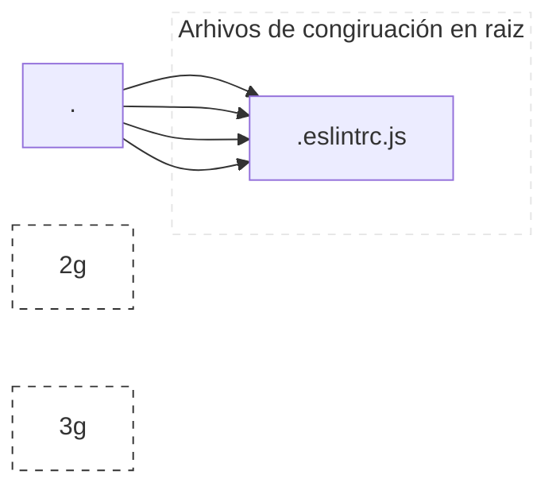

# :rocket: Code Challenge - Visual Thinking API

Proyecto desarrollado para el programa de formación [©Launch X 2022](https://launchx.rocks/) de [Innovaccionvirtual](https://www.instagram.com/innovaccionvirtual/) impulsado por [Microsoft](https://www.microsoft.com/es-mx/)

## :grey_question: Descripción

Desarrollando una API para exponer una base de datos basada en un archivo json, ello a través de 3 los siguientes end point's

| endpoint | url | descripción |
| --- | --- | --- |
| /api/students/ | http:3000//localhost/api/students/ | Obtiene todos los estudiantes de la base de datos |
| /api/students/certified | http:3000//localhost/api/students/certifiedStudents/ | Obtiene los estudiantes que tengan certificación |
| /api/students/credits/top500 | http:3000//api/students/credits/top500 | Obtienes los estudiantes con credits mayor a 500 |

> :art: Arte realizado por @carlogilmar para @LaunchX-InnovaccionVirtual

## Estructura del proyecto

